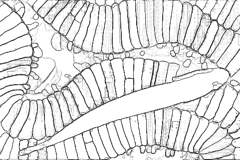

# segment-anything-edge-detection

<p>
  
</p>

This repository provides code for performing edge detection using the Automatic Mask Generation (AMG) of Segment Anything Model (SAM). Since the code used in the paper is not currently available to the public, this implementation is based on the descriptions provided in the paper.

The image on the far left is taken from the BSDS dataset. In the middle is the probability map obtained using AMG. The final image on the right is the result of applying Edge Non-Maximum Suppression (Edge NMS) to the probability map.

## Run
This repository assumes that you can already use a SAM model.
To generate the above two images, do the following:
```
python main.py
```

## TODO
- The thick lines on the probability map split into two lines after Edge NMS, so there is a need to improve the accuracy. If you know anything about edge detection, feel free to submit a pull request.
- If time permits, I may create a pipeline to perform an end-to-end evaluation of SAM's edge detection performance using the BSDS dataset.

## Reference
The code in this repository mainly uses code from the following two repositories. Thanks.
- [segment-anything](https://github.com/facebookresearch/segment-anything)
- [Edge-detection---Canny-detector](https://github.com/StefanPitur/Edge-detection---Canny-detector)