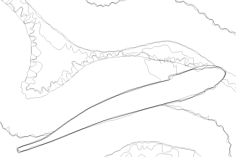
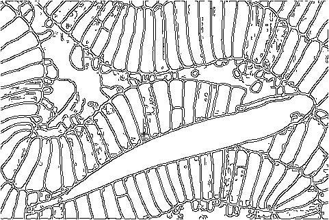

# segment-anything-edge-detection

<p>
  
</p>

This repository provides code for performing edge detection using the Automatic Mask Generation (AMG) of the Segment Anything Model (SAM) [1]. Since the code used in the paper is not currently available to the public, this implementation is based on the descriptions provided in the paper.

The image on the left is taken from the BSDS. The middle is the ground truth edge. The image on the right is the result of applying edge detection.

---

## Docker

This repository is intended to be run in a Docker environment. If you are not familiar with Docker, please install the packages listed in [requirements.txt](requirements.txt).

### Docker build

Create a Docker image as follows:

```bash
$ bash scripts/docker/build.sh
```

### Docker run
Run the Docker container by passing the GPU ID as an argument:
```bash
$ bash scripts/docker/run.sh 0
```

---

## Data

### BSDS500
download BSDS500 [2] dataset from [official site](https://www2.eecs.berkeley.edu/Research/Projects/CS/vision/grouping/resources.html).

If you cannot download it, the following mirror repositories may be helpful.
- https://github.com/BIDS/BSDS500

Then prepare the following directory structure:

```bash
data/BSDS500/
    ├── groundTruth
    │   └── test
    │       ├── 100007.mat
    │       ├── 100039.mat
    │       ...
    │       
    └── images
        ├── test
        │   ├── 100007.jpg
        │   ├── 100039.jpg
        │   ...
        │
        ├── train
        └── val
```

### NYUDv2

download NYUDv2 [3] test dataset from [EDTER](https://github.com/MengyangPu/EDTER).
Then prepare the following directory structure:

```bash
data/NYUDv2/
    ├── groundTruth
    │   └── test
    │       ├── img_5001.mat
    │       ├── img_5002.mat
    │       ...
    │       
    └── images
        ├── test
        │   ├── img_5001.png
        │   ├── img_5002.png
        │   ...
        │
        ├── train
        └── val
```

---

## Model

Create a directory to download the model as follows:

```bash
mkdir model
```

### SAM

Download the SAM model as follows:

```bash
wget -P model https://dl.fbaipublicfiles.com/segment_anything/sam_vit_h_4b8939.pth
```

### Edge-NMS

In the original paper [1], Canny edge NMS [4] was used for edge NMS.
However, in our environment, it did not produce the edges reported in the paper. 
Therefore, we temporarily used OpenCV's Structured Forests [5] model for edge NMS.

Download the Structured Forests model as follows:

```bash
wget -P model https://cdn.rawgit.com/opencv/opencv_extra/3.3.0/testdata/cv/ximgproc/model.yml.gz
```

## Prediction

To generate the image above, do the following:
```
python example.py
```
The output result is generated in `output/example`.


Predict edges as follows:

```bash
python pipeline.py --dataset BSDS500 --data_split test
```

Other arguments for initializing `SamAutomaticMaskAndProbabilityGenerator` can be passed as follows.

```bash
  -h, --help            show this help message and exit
  --dataset DATASET     BSDS500 or NYUDv2
  --data_split DATA_SPLIT
                        train, val, or test
  --points_per_side POINTS_PER_SIDE
                        Number of points per side.
  --points_per_batch POINTS_PER_BATCH
                        Number of points per batch
  --pred_iou_thresh PRED_IOU_THRESH
                        Prediction IOU threshold
  --stability_score_thresh STABILITY_SCORE_THRESH
                        Stability score threshold
  --stability_score_offset STABILITY_SCORE_OFFSET
                        Stability score offset
  --box_nms_thresh BOX_NMS_THRESH
                        NMS threshold for box suppression
  --crop_n_layers CROP_N_LAYERS
                        Number of layers to crop
  --crop_nms_thresh CROP_NMS_THRESH
                        NMS threshold for cropping
  --crop_overlap_ratio CROP_OVERLAP_RATIO
                        Overlap ratio for cropping
  --crop_n_points_downscale_factor CROP_N_POINTS_DOWNSCALE_FACTOR
                        Downscale factor for number of points in crop
  --min_mask_region_area MIN_MASK_REGION_AREA
                        Minimum mask region area
  --output_mode OUTPUT_MODE
                        Output mode of the mask generator
  --nms_threshold NMS_THRESHOLD
                        NMS threshold
  --bzp BZP             boundary zero padding
  --pred_iou_thresh_filtering
                        filter by pred_iou_thresh
  --stability_score_thresh_filtering
                        filter by stability_score_thresh
  --kernel_size KERNEL_SIZE
                        kernel size
```

See [6] for more details about boundary zero padding.

The output result is generated in `output_${dataset}/exp${exp_num}/${data_split}`.

# Evaluation
We use [py-bsds500](https://github.com/Britefury/py-bsds500/tree/master) for edge detection. Some bugs have been fixed and ported to the `py-bsds500` directory.
Compile the extension module with:

```bash
cd py-bsds500
python setup.py build_ext --inplace
```

Then evaluate ODS, OIS, and AP as follows:

```bash
cd py-bsds500/
python evaluate_parallel.py ../data/BSDS500 ../output/BSDS500/exp${exp}/ test --max_dist 0.0075
python evaluate_parallel.py ../data/NYUDv2 ../output/NYUDv2/exp${exp}/ test --max_dist 0.011
```

Note that following previous works, the localization tolerance is set to 0.0075 for BSDS500 and 0.011 for NYUDv2.

# Todo
- Since there is a large gap with the original paper in terms of performance, we would like to be able to reproduce the results.
- A high-performance Cany Edge NMS needs to be implemented to reproduce the settings of the original paper.

## Reference

### Code

The code in this repository mainly uses code from the following repositories. Thank you.
- [segment-anything](https://github.com/facebookresearch/segment-anything)
- [py-bsds500](https://github.com/Britefury/py-bsds500/tree/master)
- [opencv_contrib](https://github.com/opencv/opencv_contrib)

### Paper

[1] Alexander Kirillov, Eric Mintun, Nikhila Ravi, Hanzi Mao, Chloe Rolland, Laura Gustafson, Tete Xiao, Spencer Whitehead, Alexander C. Berg, Wan-Yen Lo, Piotr Dollar, Ross Girshick. Segment Anything. ICCV 2023.

[2] Pablo Arbelaez, Michael Maire, Charless C. Fowlkes, and Jitendra Malik. Contour detection and hierarchical image segmentation. IEEE Trans. Pattern Anal. Mach. Intell 2011.

[3] Nathan Silberman, Derek Hoiem, Pushmeet Kohli, and Rob Fergus. Indoor segmentation and support inference from RGBD images. ECCV 2012.

[4] John F. Canny. A computational approach to edge detection. IEEE Trans. Pattern Anal. Mach. Intell 1986.

[5] Piotr Dollar and C. Lawrence Zitnick. Fast edge detection using structured forests. IEEE Trans. Pattern Anal. Mach. Intell 2015.

[6] Hiroaki Yamagiwa, Yusuke Takase, Hiroyuki Kambe, and Ryosuke Nakamoto. Zero-Shot Edge Detection With SCESAME: Spectral Clustering-Based Ensemble for Segment Anything Model Estimation. WACV Workshop 2024.

---
## Related Work

The following is a list of studies on SAM and edge detection. Please let me know if you would like to add new research.

- Wenya Yang, Xiao-Diao Chen, Wen Wu, Hongshuai Qin, Kangming Yan, Xiaoyang Mao, and Haichuan Song. [Boosting Deep Unsupervised Edge Detection via Segment Anything Model](https://ieeexplore.ieee.org/abstract/document/10490131). IEEE Transactions on Industrial Informatics 2024.
- Xingchen Li, Yifan Duan, Beibei Wang, Haojie Ren, Guoliang You, Yu Sheng,
Jianmin Ji, and Yanyong Zhang. [EdgeCalib: Multi-Frame Weighted Edge Features for AutomaticTargetless LiDAR-Camera Calibration](https://arxiv.org/abs/2310.16629). arXiv 2023.
- Hiroaki Yamagiwa, Yusuke Takase, Hiroyuki Kambe, and Ryosuke Nakamoto. [Zero-Shot Edge Detection With SCESAME: Spectral Clustering-Based Ensemble for Segment Anything Model Estimation](https://openaccess.thecvf.com/content/WACV2024W/Pretrain/html/Yamagiwa_Zero-Shot_Edge_Detection_With_SCESAME_Spectral_Clustering-Based_Ensemble_for_Segment_WACVW_2024_paper.html). WACV Workshop 2024.

# Contribution

I may be slow to respond, but everyone is welcome to contribute. 