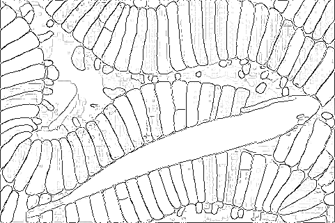

# segment-anything-edge-detection

<p>
 
</p>

This repository provides code for performing edge detection using the Automatic Mask Generation (AMG) of the Segment Anything Model (SAM). Since the code used in the paper is not currently available to the public, this implementation is based on the descriptions provided in the paper.

The image on the left is taken from the BSDS dataset. <!-- The center is the ground truth edge.  --> The image on the right is the result of applying edge detection.

## Requirements
This repository assumes that you can already use a SAM model. 
Note that this repository uses `opencv-contrib-python`, not `opencv-python`, so install it as follows:
```bash
pip install opencv-contrib-python
```
See [the description](https://pypi.org/project/opencv-contrib-python/) for more details.

You will also need to download the model for Edge NMS beforehand.
```bash
cd /working/model
wget https://cdn.rawgit.com/opencv/opencv_extra/3.3.0/testdata/cv/ximgproc/model.yml.gz
```

## Run
To generate the image above, do the following:
```
python main.py
```

## TODO
- If time permits, I may create a pipeline to perform an end-to-end evaluation of SAM's edge detection performance using the BSDS dataset.

## Reference
The code in this repository mainly uses code from the following two repositories. Thank you.
- [segment-anything](https://github.com/facebookresearch/segment-anything)